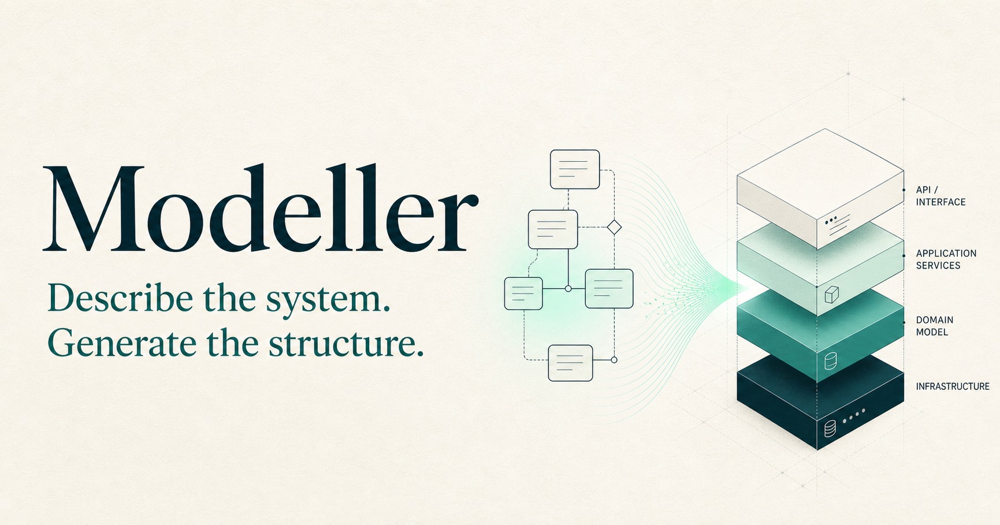

# Modeller

<picture>
  <source media="(prefers-color-scheme: dark)" srcset="public/brand/modeller-hero-dark.png">
  <source media="(prefers-color-scheme: light)" srcset="public/brand/modeller-hero-light.png">
  
</picture>

This repository contains **Modeller**. The local directory and repository retain
the temporary `Modeller.Next` label, but the product and its documentation use
the Modeller name.

Canonical project documentation lives in `docs/` and is rendered by the
Next.js/Fumadocs application in this repository.

## Development

```bash
npm install
npm run dev
```

The implementation is a .NET 10 solution. Run its model contract tests
independently of the documentation site:

```bash
dotnet test Modeller.slnx
```

Versioned acceptance assets live in `conformance/`. The `Modeller.Conformance`
module runs those fixtures against capability adapters without inspecting their
implementations.

`Modeller.Contexts` loads and canonically persists independently versioned
context packages, resolves exact import/export dependencies into immutable
federation snapshots, and executes explicit schema migrations. Its public
contract is documented in the
[context-package reference](docs/reference/context-packages.mdx).

`Modeller.Validation` validates authored contexts, package candidates, and
resolved snapshots through one deterministic staged interface documented in the
[semantic-validation reference](docs/reference/semantic-validation.mdx).

`Modeller.Parsing` compiles the business-readable
[Readable Modelling Language](docs/reference/readable-modelling-language.mdx),
or the lower-level [Semantic Authoring Format](docs/reference/readable-source-language.mdx),
into that same canonical model while retaining safe source provenance and
diagnostics.

`Modeller.Rules` binds validated federation snapshots into immutable runtime
plans and evaluates typed facts with deterministic results, findings, evidence,
and canonical traces.

For the complete development experience, open `Modeller.Next.code-workspace` in
VS Code. Run the `setup`, `docs: dev`, or `verify` tasks from the task picker.
Press F5 and choose **Modeller Docs** to start the development server and open
the site with browser debugging attached.

Contributor setup, entry-point commands, targeted testing, and VS Code extension
development are documented in the
[contributor guide](docs/contributing/index.mdx).

The existing `CSharp-Catalyst/Modeller` repository is retained as historical
design evidence. It is not a compatibility target or an alternative product
implementation.

The repository is hosted under `Allann/Modeller.Next`
because GitHub currently reports that the legacy `CSharp-Catalyst` organisation
is being deleted and will not accept new repositories.

## Brand assets

The reusable light and dark marketing heroes live under `public/brand/`. Their
composition, wording, and architecture diagram should remain consistent across
the documentation site, repository pages, launch material, and social previews.
