# Architecture 101: Building Modeller One Decision at a Time

## The core idea

Architecture is not the number of boxes in a diagram. It is the set of decisions
that protect the meaning we care about.

For Modeller, the durable thing is the business model: the
[behaviours](/docs/concepts/ubiquitous-language#behaviour) a business performs,
the [facts](/docs/concepts/ubiquitous-language#fact) and
[rules](/docs/concepts/ubiquitous-language#rule) behind its
[decisions](/docs/concepts/ubiquitous-language#decision), and the
[outcomes](/docs/concepts/ubiquitous-language#outcome) those behaviours produce.
Parsers, diagram editors, template engines, generated languages, and AI
providers can all change. They must not silently change that meaning.

The architecture therefore grows one pressure at a time. Every seam below solves
a named problem and introduces a cost. If a seam does not protect domain meaning,
make change safer, or enable a required adapter, it has not yet earned its place.

## Stage 0: Put behaviour at the centre

An [entity](/docs/concepts/ubiquitous-language#entity)-only model describes what
data exists but not why the system exists. Modeller begins with
[behaviour](/docs/concepts/ubiquitous-language#behaviour)—one complete,
externally meaningful thing the system can do—as the organising principle.

An [actor](/docs/concepts/ubiquitous-language#actor) participates through a named
domain role. A [command](/docs/concepts/ubiquitous-language#command) requests
potentially state-changing behaviour; a
[query](/docs/concepts/ubiquitous-language#query) requests information without
domain effects. An [event](/docs/concepts/ubiquitous-language#event) records a
domain-significant fact after it occurs. A
[workflow](/docs/concepts/ubiquitous-language#workflow) is itself a behaviour
that coordinates other behaviours toward a domain outcome.

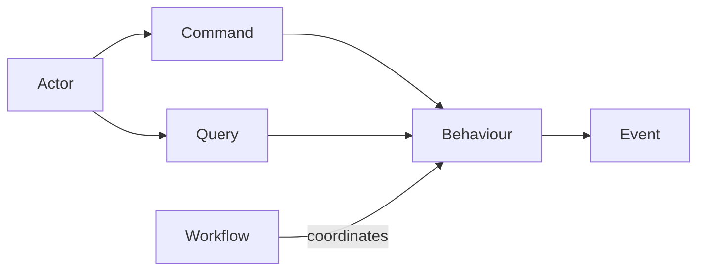

[Capabilities](/docs/concepts/ubiquitous-language#capability) group behaviours by
enduring business purpose without becoming executable or prescribing the
implementation structure.

**Pressure introduced:** a behaviour needs typed inputs, participating entities,
rules, effects, transitions, and events. Those concepts cannot remain prose if
tools are expected to reason about them.

## Stage 1: Add the semantic model

The semantic model gives those concepts stable, Modeller-owned meaning.
[Entities](/docs/concepts/ubiquitous-language#entity) provide stable identity and
continuity through changes in [state](/docs/concepts/ubiquitous-language#state).
Their [lifecycle](/docs/concepts/ubiquitous-language#lifecycle) defines meaningful
stages and permitted [transitions](/docs/concepts/ubiquitous-language#transition).
[Guards](/docs/concepts/ubiquitous-language#guard) decide whether a behaviour or
transition is currently allowed. Successful behaviours cause transitions;
events record the significant facts that result. Persistence remains outside
the domain meaning.

Independently versioned
[bounded contexts](/docs/concepts/ubiquitous-language#bounded-context) own these
concepts and expose explicit semantic surfaces. They federate into one resolved
[snapshot](/docs/concepts/ubiquitous-language#federation-snapshot) without
requiring separate packages, processes, or deployments.

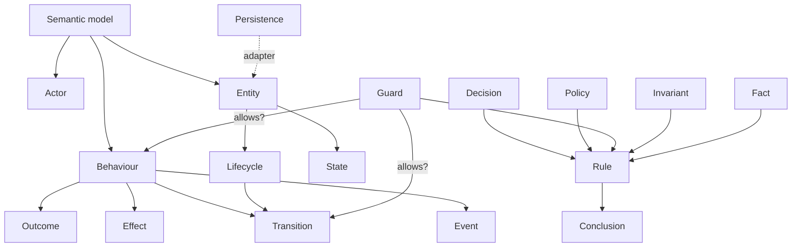

This is the first deep module: callers work with a small domain vocabulary while
the model hides identity resolution, references, type relationships, and
invariants.

**Pressure introduced:** authors need a readable way to create the model, and old
definitions need a controlled migration path.

## Stage 2: Separate authoring from meaning

The authoring language is an input format, not the model itself. A parser turns
source text into the semantic model and reports diagnostics in terms an author
can act on. Future YAML, editor, or import adapters can reach the same model
without becoming alternative sources of truth.

The [persistence decision](/docs/architecture/decisions/canonical-persistence-versioning-migration)
stores each bounded context as an independently versioned
[context package](/docs/concepts/ubiquitous-language#context-package). Canonical
UTF-8 JSON documents carry semantic meaning; file partitioning, layout, and
[source provenance](/docs/concepts/ubiquitous-language#source-provenance) do not.
Stable IDs survive renames and file moves, while a
[semantic digest](/docs/concepts/ubiquitous-language#semantic-digest) identifies
normalized meaning independently of those presentation choices.

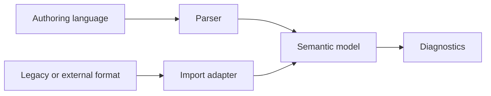

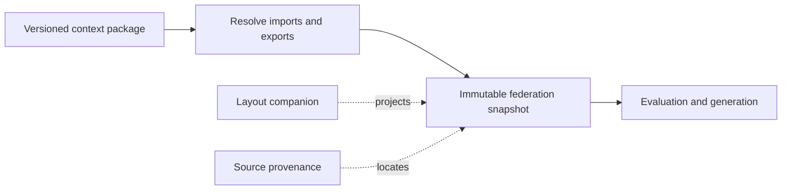

[Schema versions](/docs/concepts/ubiquitous-language#schema-version) describe
persistence structure; [context versions](/docs/concepts/ubiquitous-language#context-version)
describe compatibility of exported domain meaning. Explicit
[migrations](/docs/concepts/ubiquitous-language#migration) keep those concerns
separate: schema migrations preserve the semantic digest, while model migrations
are authored semantic changes. Loaders never silently upgrade packages.

Keeping this seam explicit means syntax can improve without forcing every
consumer to understand tokens or syntax trees. It also prevents a convenient
exchange format from defining Modeller's semantics by accident.

**Pressure introduced:** rules contain executable-looking expressions. Their
meaning must remain stable across authoring syntax, generated code, and external
decision engines.

## Stage 3: Own rule-expression semantics

Source expressions compile to a small, versioned, statically typed canonical
representation. A bounded, pure reference interpreter defines what those
expressions mean. Generated C# and external decision formats are adapters; they
must preserve the canonical behaviour.

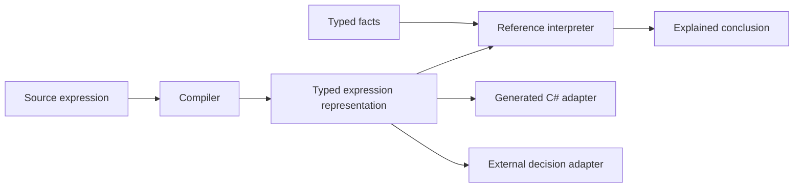

[Rules](/docs/concepts/ubiquitous-language#rule) evaluate typed
[facts](/docs/concepts/ubiquitous-language#fact) and produce explained
[conclusions](/docs/concepts/ubiquitous-language#conclusion).
[Decisions](/docs/concepts/ubiquitous-language#decision) compose rules to resolve
domain questions, with [findings](/docs/concepts/ubiquitous-language#finding)
explaining how they arrived at a conclusion.

[Policies](/docs/concepts/ubiquitous-language#policy) express choices about what
is permitted, required, or entitled. Guards apply rules to whether a behaviour
or transition is allowed now; [invariants](/docs/concepts/ubiquitous-language#invariant)
protect every observable state. Behaviours, not any of these rule forms, own
[effects](/docs/concepts/ubiquitous-language#effect). This keeps evaluation pure
enough to test and explain while leaving state changes in the behaviour that
requested them.

The [reusable rules runtime](/docs/architecture/decisions/reusable-rules-runtime)
implements the [rule evaluation interface](/docs/architecture/decisions/rule-evaluation-interface).
It binds a resolved snapshot and deterministic function catalog into an
immutable [runtime plan](/docs/concepts/ubiquitous-language#runtime-plan), then
exposes one concurrent `Evaluate` operation. Requests carry typed facts and
[evidence](/docs/concepts/ubiquitous-language#evidence); immutable results
separate conclusions and findings from diagnostics and optional canonical
traces.

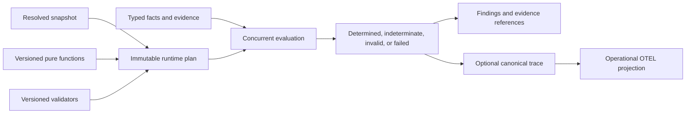

Missing information is neither false nor null. It produces an indeterminate
result only when the conclusion logically depends on it. Canonical results and
traces exclude ambient time, locale, randomness, network state, and operational
timing so equivalent evaluations remain structurally equal.

Decision tables execute within the same runtime rather than a separate engine.
Alternate interpreters and generated runtimes implement the same complete
interface and pass common conformance fixtures. Deterministic work budgets
produce stable failures; host timeouts, process isolation, caching, rendered
explanations, and OpenTelemetry are operational concerns that cannot change a
semantic result.

The [behaviour-governance decision](/docs/architecture/decisions/rules-governing-behaviours)
connects that pure evaluation module to domain action through explicit
[rule bindings](/docs/concepts/ubiquitous-language#rule-binding). Authorization,
requirements, classifications, transition guards, and invariants evaluate
before a behaviour commits its outcome, transition, effects, and durable event
intents.

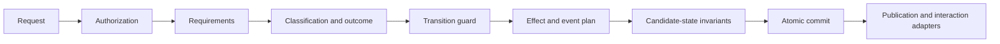

Rules explain; behaviours act. No rule evaluation executes effects, and no
adapter runs before the final invariant check and atomic commit.

**Pressure introduced:** users and tools need different views of the same model,
including diagrams, documentation, and code.

## Stage 4: Treat every view as a projection

A diagram is useful, but the position of a box is not domain truth. The semantic
model feeds projections for people and generators for machines. No projection is
allowed to quietly become a second model.

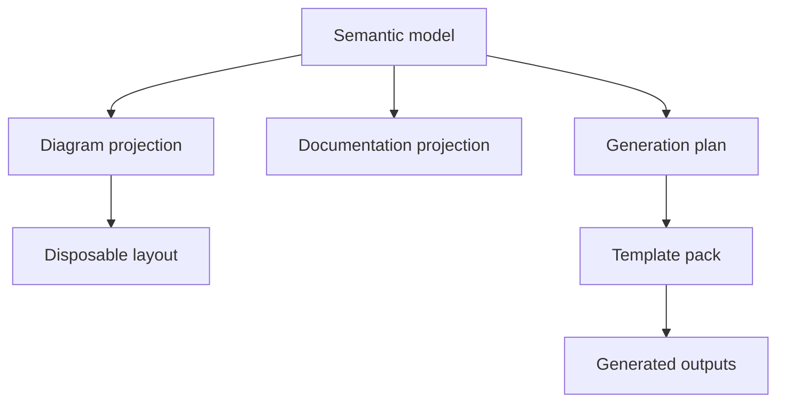

Diagram layout can be saved as presentation metadata, regenerated, or discarded.
Documentation can emphasise behaviours and decisions. A generation plan can
select the semantic inputs required by a template pack. All three remain views
over one authority.

**Pressure introduced:** generating files repeatedly is dangerous unless output
ownership and overwrite rules are explicit.

## Stage 5: Plan before writing

Generation is split into planning, rendering, and writing. Template packs encode
a chosen software architecture; they do not own the domain model. The plan makes
the intended files and their ownership visible before the filesystem changes.

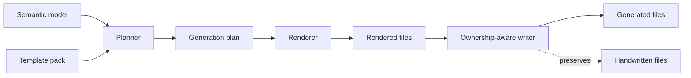

Generated files carry traceability back to the model and template pack. Files
owned by developers remain separate and are not overwritten. This turns
regeneration from a risky replacement operation into an ordinary workflow.

**Pressure introduced:** template engines, target languages, filesystems, and AI
providers vary. They need extension points without being able to redefine the
core.

## Stage 6: Put integrations at the boundary

Adapters translate between Modeller and the outside world. AI may help author,
explain, or review a model, but it operates through explicit model operations.
It does not become a hidden second implementation of the domain.

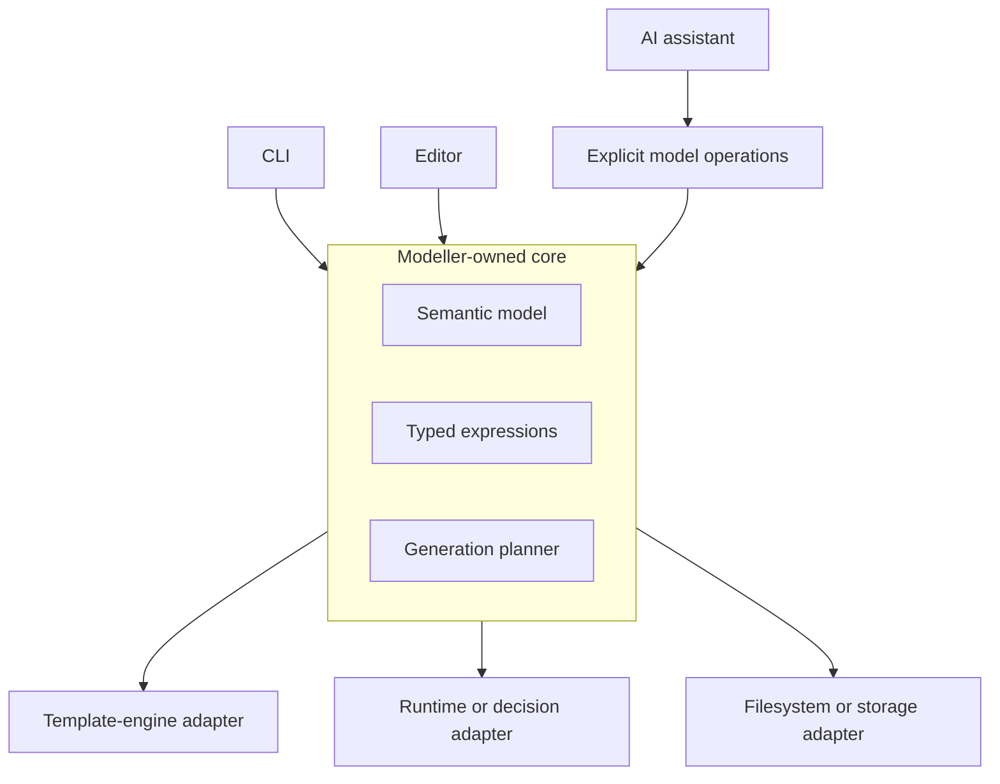

This is where dependency inversion becomes concrete: replaceable tools depend on
Modeller's contracts. The core does not depend on a particular UI, host language,
template engine, persistence product, or AI provider.

## The full picture

The complete architecture is a flow from authored intent to verified outputs,
with one semantic authority in the middle.

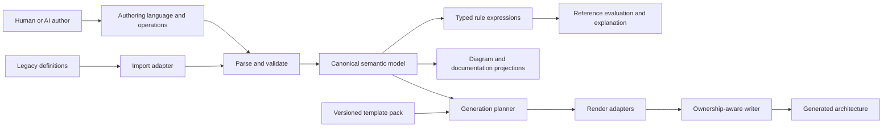

The architecture is intentionally asymmetric. Many authoring and integration
paths may enter or leave the system, but all of them pass through Modeller-owned
semantics. That narrow waist is what lets the edges evolve without fragmenting
the meaning of a model.

## What is settled, and what is not

This page applies the accepted [successor semantic baseline](/docs/architecture/decisions/successor-semantic-baseline)
and [canonical rule-expression decision](/docs/architecture/decisions/canonical-rule-expressions).
The accepted vocabulary is collected in the
[ubiquitous language](/docs/concepts/ubiquitous-language). Architecture pages,
model definitions, and implementation interfaces must use those terms
consistently. The vocabulary was accepted through Wayfinder issue #15.

## The takeaway

Modeller does not need every adapter, projection, or target language on day one.
It does need one authoritative semantic model, explicit ownership of expression
meaning, and a generation path that preserves handwritten work.

Defer replaceable choices. Be strict about meaning. Add each new box only when
you can name the pressure it resolves.
