# Architecture 101: Building Up Complexity One Decision at a Time

## The core idea

An architect's job isn't to draw every box on day one. It's to decide **what to leave out**, and to say "no — not yet" more often than "yes." Every box in the diagram below was added *on purpose*, to solve a specific, named problem. If you can't name the problem a box solves, you probably don't need the box.

There is no such thing as a universal "best practice." Companies like Twitter can afford mistakes you can't. What follows is a set of components explained in the order you'd actually reach for them, each one paired with the pain it removes and the pain it introduces.

The end state of this guide matches the full reference architecture below — by the end, every box in it should be justifiable, even if you choose not to use all of them.

---

## Stage 0: Client and Database

Every application starts here. If it's not talking to a database, it's not a data-driven app (Notepad and Solitaire excepted).

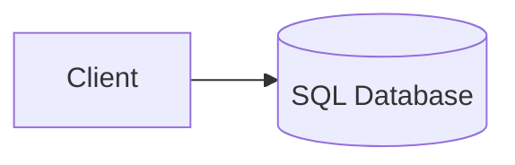

**Problem with stopping here:** talking to the database directly means leaking the schema into your application. Your app and your schema are now coupled, your app developers need to be good SQL developers, and SQL ends up mixed into your application code.

---

## Stage 1: Introduce the API

The API's job is to abstract the database away — separate the concern of "talking to SQL" from the concern of "being the app."

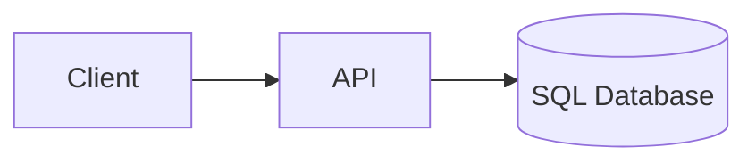

This also solves a quieter problem: **database drivers**. Drivers need installing, versioning, and regular upgrading (mostly for security, not just speed). Moving the API next to the database means the driver dependency lives in one place — not baked into every client — and the API/client contract is now free to evolve at its own pace, as long as the surface area (the contract) stays stable.

*Cross-cutting concern worth adding here, even though it won't help you yet: telemetry (OpenTelemetry is the default choice today). It does nothing for you during development — it earns its keep the day you're debugging a production issue with your boss standing behind you.*

---

## Stage 2: Split reads from writes (CQRS) + a read replica

Most applications are write-heavy and read-light, or the reverse. Splitting the API into write and read paths (physically or just logically) lets you scale each independently — without touching your codebase, you could deploy the same code twice and point writes at one and reads at the other.

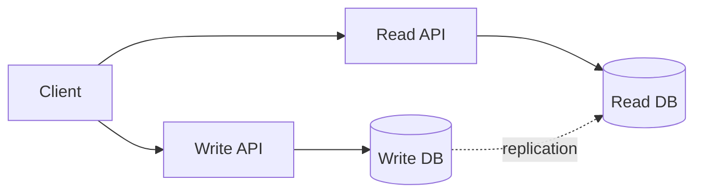

This is cheap: it's a connection string and a second deployment. The catch is **eventual consistency** — replication is fast, but never instant (no tier of Azure increases the speed of light). A simultaneous read-after-write can return stale data. Know the caveat before you ship it.

---

## Stage 3: Split into services, and connect them with a service bus

Once you have more than one backend concern, it often pays to split into separate services (micro or macro — the size doesn't matter, the isolation does). But now those services need to talk to each other.

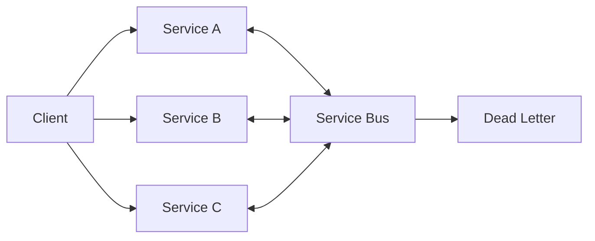

A service bus is a concept, not a specific product (Azure Service Bus is one implementation among many open-source options) — think of it as a postman: it takes a message and makes sure it gets delivered, with retries and timers along the way.

Every service bus needs a **dead letter** story. Messages that can't be delivered land there — and if nobody is watching that queue, it's a silent failure waiting to happen. Adding a service bus means also owning what happens when it fails.

---

## Stage 4: Connect to existing systems

If your company has other systems already, the service bus becomes the shared integration point — not something owned by your solution, but a shared piece of infrastructure other systems plug into as well.

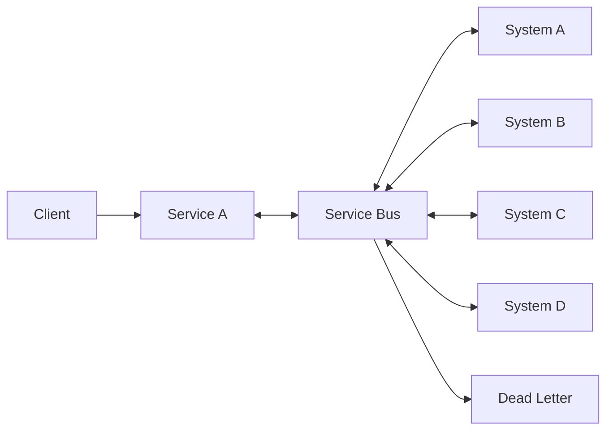

Use this only when you need to *operationally* engage with those systems (trigger something as a result of what you did). If you're just merging data for reporting, you don't need this — you need the data lake (Stage 10).

---

## Stage 5: Add an API Manager (APIM)

If you have an API and no API manager / gateway in front of it, that's worth questioning. It costs you nothing at the start and everything the day you need to ship v2 of your API.

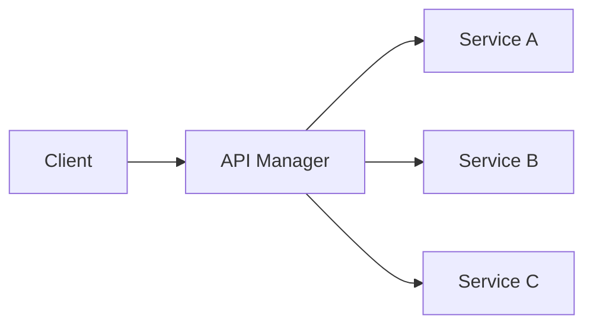

An APIM can transform a v1 payload into a v2 call transparently, handle A/B rollout, rate limiting, load balancing, and denial-of-service protection — and it makes several microservices look like one coherent API surface to the client. Skipping it doesn't hurt today; it hurts the next developer who has to version your API without one.

---

## Stage 6: Make each service resilient — cache, retry, queue

These are concepts you add *inside* each service, not new boxes on the big picture, but they matter enormously.

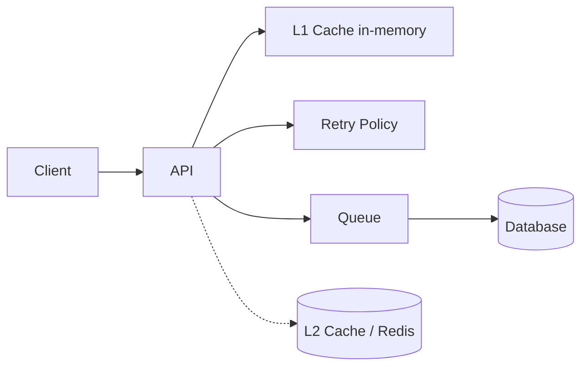

- **L1 cache (in-memory):** the fastest thing you have. Even one second of cache on hot data (e.g. a country dropdown) transforms API capacity and prevents "stampeding" — many requests hitting a cold cache at once.
- **L2 cache (Redis or similar):** a cheap key-value store for query results that are expensive to compute but cheap to look up again.
- **Retry policy:** transient failures happen (network blip, timeout). Retry a bounded number of times (exponential backoff) before giving up — most drivers support this natively now.
- **Queue (persisted, not in-memory):** when your API can accept more requests than your database can process, don't reject the excess — queue it. Tell the client "got it" immediately and process the backlog as capacity allows. This doesn't work for everything (credit card transactions, for instance) but it works for most things.

---

## Stage 7: React to change — Event Hub, Functions, and pushing updates to the client

A service bus moves messages you send. An **event hub** responds to things that happened — it ingests continuously and is built to never be overwhelmed.

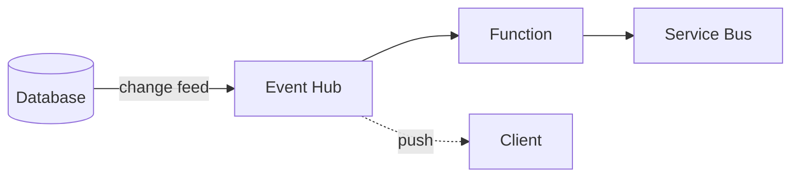

Databases like SQL Server support **change event streaming** — every row change can be pushed to the event hub instead of clients polling ("did it change yet? did it change yet?"), which degrades database performance over time. The event hub triggers a function to do the actual work, which can in turn notify the service bus.

The same event hub can push straight to the client (e.g. over WebSockets), which kills the "please don't refresh this page" anti-pattern — the UI updates itself the moment the backend is actually done, instead of the user hammering F5.

---

## Stage 8: Serve the client efficiently — static content and CDN

Not everything needs to hit your application server.

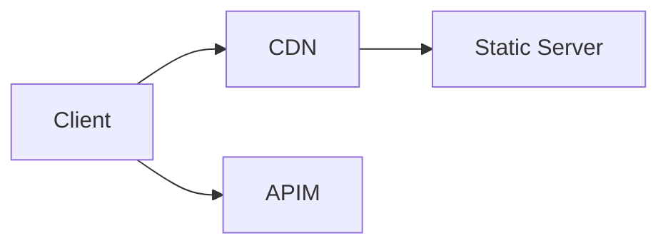

Content that never changes (images, assets) shouldn't invoke your app server or middleware at all — serve it from a static host, and put a CDN in front of it so users far from your region aren't waiting on the speed of light.

---

## Stage 9: Pick the right storage shape for each table

"Database" isn't one thing — pick the storage engine per table, based on its access pattern:

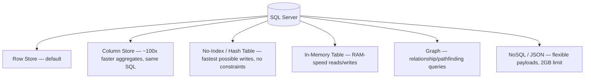

- **Row store** — the default, free, works like a spreadsheet.
- **Column store** — a checkbox, not a new product. ~100x faster for aggregates, with dramatic compression, and no change to how you write SQL against it.
- **No-index / hash table** — the fastest possible insert path (no clustered index reordering), but you give up constraints and relational guarantees. Google it before you reach for it.
- **In-memory table** — RAM-speed reads and writes; choose whether writes also persist to disk (survives a restart) or not (pure speed, lost on recycle).
- **Graph** — native support for relationship queries (shortest/cheapest path across a network — e.g. warehouse/shipping-lane routing) without moving data out of your relational store.
- **NoSQL/JSON** — good for holding a payload you don't want to fully model yet; SQL Server stores it in a fast binary format, with a 2GB per-document ceiling.

---

## Stage 10: Cut the boilerplate API layer — Data API Builder — and add AI

A large fraction of "create a Web API project, wire up EF Core, write CRUD controllers" work is copy-paste inheritance from one project to the next. **Data API Builder (DAB)** — open source, `aka.ms/dab` — generates REST and GraphQL endpoints directly from Postgres, SQL Server, Cosmos DB, or MySQL, and can replace the majority of hand-written data APIs.

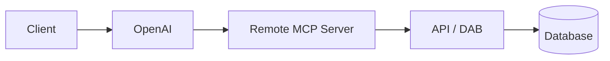

If you're adding AI to the client, don't let the model talk to your database directly — ever. Route it through an MCP server, which talks to your existing API, which is the only thing allowed to talk to the database.

---

## Stage 11: Give the client an offline experience

The same cache + queue concepts from Stage 6 apply on the client, not just the server:

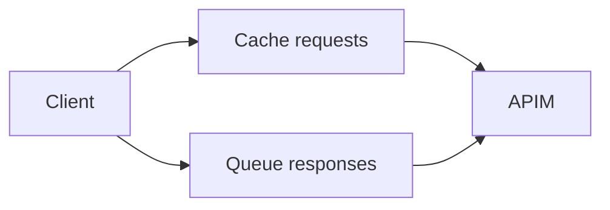

Cache outbound requests and queue results, and the app keeps working through a dropped connection — the same trick that makes Outlook tolerable when you're going through a tunnel.

---

## Stage 12: Feed a data lake, and close the loop with ML

Data siloed in one system has no cross-system value. Pull it (and data from other existing systems) into a lake via EL/ETL, and use it as the source for both reporting and ML.

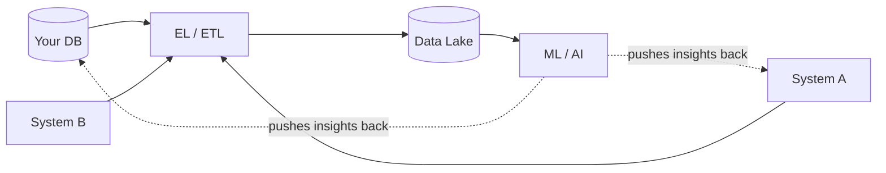

The lake by itself is just reporting. The value shows up when the ML layer's output is pushed *back* into the operational systems (e.g. product recommendations), not just displayed on a dashboard.

---

## Stage 13: Security — identity, tokens, and fine-grained access

Briefly, because it deserves its own talk:

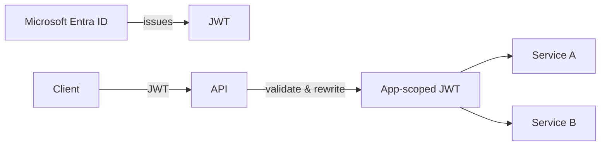

Entra ID (formerly Azure AD) issues a signed JWT containing your identity and group claims. You *can* push your application's fine-grained permission model into your tenant, but it's usually a better trade to keep high-level roles in the tenant and let your application rewrite the validated token with fine-grained, app-specific claims before passing it downstream. Get this wrong and it's one of the most dangerous mistakes in the whole diagram — read up before implementing.

---

## The full picture

Put every stage together and you get the reference architecture below — the one the talk opened with. Every box now maps to a specific problem from the sections above:

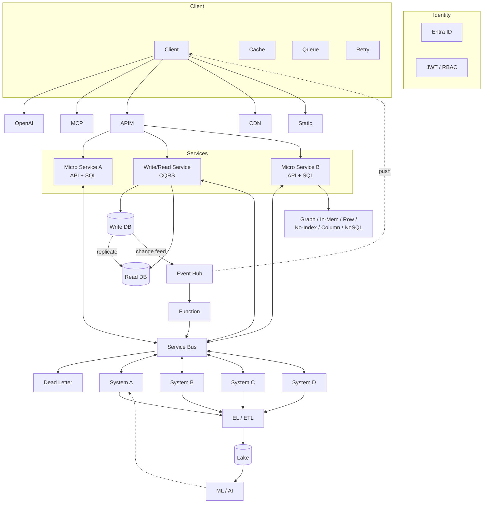

---

## The takeaway

None of these boxes are free, and none of them are mandatory. Each one earns its place by removing a specific, named pain — and each one you *don't* add is one less thing that can break, one less thing to upgrade, one less thing the next developer has to understand before they can be productive.

**Defer decisions.** It feels like the architect's job is to decide everything up front, but the longer you can put a decision off, the cheaper it is to change your mind later. Simplicity is the best architecture.
